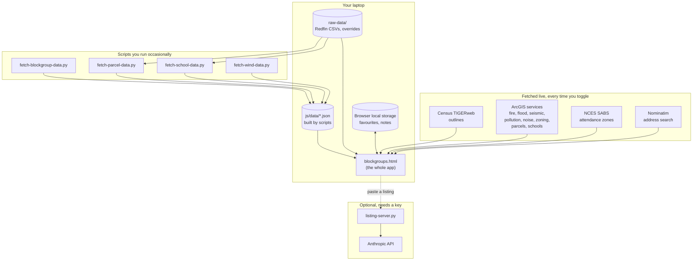

# How data gets into the app

## The shape of it



Three ways data arrives, and the difference matters:

- **Live** — fetched from the publisher when you turn a layer on. Always
  current. Breaks if they change something.
- **Built** — a script downloads a big file once and boils it down. Fast, and
  stale until you re-run it.
- **Yours** — CSVs you drop in, and notes in your browser.

## Every source

| What | Where from | How | Type | Breaks if |
|---|---|---|---|---|
| Block group / tract / zip outlines | Census TIGERweb | Live | ArcGIS REST | Census renames a layer |
| Demographics, income, housing (23 ACS tables) | Census API | Built — `fetch-blockgroup-data.py` | JSON API | ACS retires a table |
| Home prices, sales | LA County Assessor | Built — `fetch-parcel-data.py` | You download a CSV | Column names change |
| Active listings | Redfin | Yours — CSVs in `raw-data/redfin-listings/` | Static CSV | Redfin changes its export |
| School zones | NCES SABS 2015-16 | Live | ArcGIS REST | NCES takes it offline |
| School zones (fallback) | LA City GeoHub | Live | ArcGIS REST | — |
| School dots | CA Dept of Education | Live | ArcGIS REST | — |
| School ratings (GreatSchools) | You | Yours — `raw-data/school-ratings/*.csv`, attached by `fetch-school-data.py` | Static CSV | — |
| School directory (to place your rows) | CA Dept of Education | Built — `fetch-school-data.py` | Download | CDE moves the file |
| Fire hazard | CAL FIRE | Live | ArcGIS REST | — |
| Flood | FEMA NFHL | Live | ArcGIS REST | — |
| Seismic | CA Geological Survey | Live | ArcGIS REST | — |
| Pollution | CalEnviroScreen 4.0 | Live | ArcGIS REST | — |
| Noise | BTS / DOT | Live | Cached map tiles | — |
| Wind | Global Wind Atlas | Built — `fetch-wind-data.py` | You download a GeoTIFF | — |
| Jurisdiction, zoning, HPOZ, parcels | LA County + LA City GIS | Live | ArcGIS REST | Host swaps (it has before) |
| Satellite | Esri World Imagery | Live | Map tiles | — |
| Address search | Nominatim | Live | JSON API | Rate limit if hammered |
| Listing extraction | Anthropic API | Optional | Needs `listing-server.py` + key | No key, no package |

## How it fails

The app is built to degrade, not crash. One dead source never takes down the page.

| Failure | What you see |
|---|---|
| A service is down | That layer doesn't draw. Status log names the URL and error. Everything else works. |
| A service moved | Most layers have 2+ candidate URLs and try each. Log says which answered. |
| A field got renamed | Fields are read by candidate list, so a rename usually survives. If not, the row is blank rather than wrong. |
| A data file is missing | The card says which script to run, with the exact command. |
| A data file is out of date | The card says so and names the script. Version-checked, not guessed. |
| No WebGL | Falls back to raster tiles. Says so, and warns it stops at zoom 16. |
| Opened as `file://` | Banner explains why data can't load. |
| Rate limited | Retries with backoff, then reports it. |

**The status log is the diagnostic surface.** It's in the left pane. When
something looks wrong, read it first — it names the URL, the error and usually
the fix.

## What to watch

Realistically, check these when something looks off — not on a schedule.

**Monthly-ish, or when a layer goes blank:**
- Status log for red lines after toggling each layer.
- That the ArcGIS hosts still answer. LA County has swapped hosts before.

**Yearly:**
- Re-run `fetch-blockgroup-data.py` when new ACS data lands (usually December).
- Re-run `fetch-school-data.py` whenever you update your GreatSchools table.
- Re-download the Assessor roll and re-run `fetch-parcel-data.py`.

**When you get new listings:**
- Drop fresh Redfin CSVs in. No script.

**Never:**
- Nothing auto-updates. Nothing phones home. Nothing expires.

## Running the tests

If you change anything, or a layer looks broken:

```
node tests/blockgroups-e2e.js      # 360 checks, the whole app in a real browser
node tests/mock-e2e.js             # 24 checks
python3 tests/test_school_data.py  # and the other 6 test_*.py
```

They run offline against stubbed services, so a green run means the *code* is
fine — it doesn't prove a real service is up.
